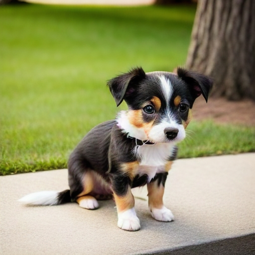

# XiaoMi Stable Diffusion

If you are familiar with English, you can read [English Version](README_EN.md)

## 介绍

你可以尝试使用小米的端侧部署框架运行Stable Diffusion模型。

  

这个project中包含了两个分支

### NPU分支
NPU分支主要使用嵌入式神经网络处理器（NPU）进行计算，可以在小米13系列和小米14系列上使用。分支默认是在米13系列上使用，如果需要切换到小米14系列上使用本框架，需要在`CMakeLists.txt`中修改`DL_MODE为2`即可。

### CPU分支
CPU分支采用中央处理器（CPU）进行计算，可以在符合系统要求的任意小米手机上工作。你可以自由选择模型推理步数，种子数，以及生成图像的尺寸，从而调整图片生成的效果。

## 安装须知：
1. 进入 $ROOT/app/src/main/cpp，运行[opencv.sh](app\src\main\cpp\opencv.sh)安装opencv库
2. 进入 $ROOT/app/src/main/cpp/boost，在[boost.sh](app\src\main\cpp\boost\boost.sh)中将$NDK_ROOT替换成合适的ndk路径（如android-ndk-r25c），运行boost.sh安装boost库
4. 进入 $ROOT/app/src/main/assets/stable_diffusion，按照[README.md](app/src/main/assets/stable_diffusion/README.md)安装高通库文件
3. 按照下述模型下载中要求对应平台的模型

### 模型下载
在[Huggingface](https://huggingface.co/billlight/XiaoMiStableDiffusionV1.0)上下载模型放入下述目录

QNN分支:
* 小米13系列: root_folder/app/src/main/assets/stable_diffusion/qnn_model_8550/
* 小米14系列: root_folder/app/src/main/assets/stable_diffusion/qnn_model_8650/

ONNX分支:
* 小米各系列: root_folder/app/src/main/assets/stable_diffusion/onnx/

未量化模型地址: 
* [runwayml/stable-diffusion-v1-5](https://huggingface.co/apple/coreml-stable-diffusion-v1-5)

## 系统要求

|SDK                 | NDK               | CMAKE             | DEVICE PLATFORM      |
|:------------------:|:-----------------:|:-----------------:|:--------------------:|
|33                  |26.0.10792818      | 3.18.1            |Xiaomi 8 Gen 2/8 Gen 3|

## 性能

|      Device        |    Platform       | Processing Unit   |  Units of Memory  | Model Size(GB)     | Memory Request(GB) | Image Resolution  |Inference Time(s)  |
|:------------------:|:-----------------:|:-----------------:|:-----------------:|:------------------:|:-----------------: |:-----------------:|:-----------------:|
|  Xiaomi 13/Pro     |  8Gen2            |  NPU              | INT8              | 1.10               | 1.5                | 512               | 9.4               |
|  XiaoMi 14/Pro     |  8Gen3            |  NPU              | INT8              | 1.10               | 1.5                | 512               | 4.6               |
|  Xiaomi 13/Pro     |  8Gen2            |  CPU              | FLOAT16           | 1.93               | 12                 | 256               | 134               |
|  XiaoMi 14/Pro     |  8Gen3            |  CPU              | FLOAT16           | 1.93               | 12                 | 256               | 103               |

注意事项:
* 这份数据出自小米集团手机部，均在小米13系列和小米14系列上完成测试，测试时间2023年10月。
* 以上参数的具体解释如下:
    * Device是测试用机型。
    * Platform是测试机型对应芯片型号。
    * Processing Unit是选用的计算单元。
    * Model Size是SD模型大小。
    * Memory Request是运行时的内存占用。
    * Inference Time是一张图片的生成时间。
* 图像生成过程是标准SD生图流程:20步，77文本标识长度。
* 如果文本真实长度长度超过77，那么会按照77进行裁剪，裁剪到包含开始和结束标识符也只有77文本长度的大小。
* Unet的运行batch为1，所以需要分别对正负文本顺序执行两次Unet，再进行计算。
* NPU上运行的模型参数是W8A16，CPU上运行的模型参数是W16A16。
* CPU版本需要较大的手机运行内存才能够正常运行。
* 本项目基于Stable Diffusion V1.5架构进行开发，暂不支持其他架构的SD模型
* 性能强依赖于手机本身的性能，负载状态，以及机身温度等手机状态。

## 模型量化

小米SD采用训练后量化（PTQ）将Float32的模型转换为INT8数据类型的量化模型，将模型大小缩减到了约$\frac{1}{4}$的大小，模型大小约为1.1GB。

通过收集高精度校准数据和优化量化方法方法对模型进行量化:
* 校准数据集收集:收集多领域、高质量prompt数据集，作为Calibration数据集。
* 量化校准方法:使用AdaRound量化算法，采用高精度per-channel方法，使浮点权重参数择优选择8bit定点值。

PTQ能够在不牺牲SD大模型性能的前提下，大幅度降低模型的存储和计算需求，从而提高了模型在资源受限环境下的可用性。

## 模型部署 

相比于CPU方案，小米SD将量化后模型通过QNN框架部署在高通的NPU上，充分利用了NPU的并行计算能力，让深度学习中的矩阵运算和卷积运算等高密度的算子可以利用到芯片层的硬件加速，从而达到降低功耗，提升计算效率的目的。

* 模型大小减少75%+
* 内存使用减少75%+
* 推理速度提高95%+

## License
[MIT-License](LICENSE.md)

